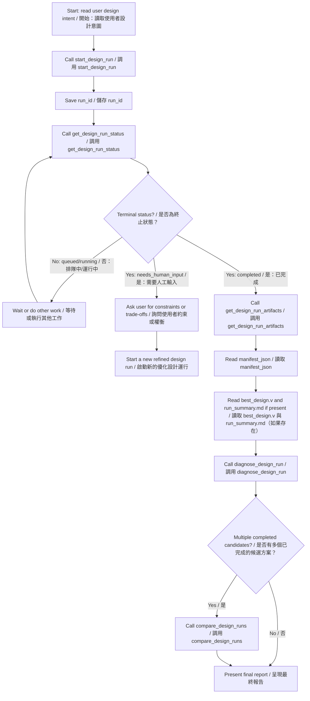

# MCP Agent Integration & Installation Guide
# MCP 智能體整合與安裝指南

> [!NOTE]
> **Target Audience:** This document is written for AI agents and coding assistants that need to install, configure, test, and register this repository as a Model Context Protocol (MCP) server.
> **目標受眾：** 本文件專為 AI 智能體及編碼助理撰寫，以協助安裝、配置、測試本儲存庫，並將其註冊為模型上下文協定（Model Context Protocol, MCP）伺服器。

This project currently exposes a **local stdio MCP server** through `python -m mcp_server.server`. Local clients such as Claude Desktop, Cursor, Windsurf, VS Code-style agents, and custom stdio MCP clients can use it directly. Remote or hosted MCP clients require an additional HTTP/remote MCP wrapper that this repository does not yet provide.

本專案目前透過 `python -m mcp_server.server` 提供**本地 stdio MCP 伺服器**。本地用戶端（如 Claude Desktop、Cursor、Windsurf、VS Code 風格的智能體以及自訂 stdio MCP 用戶端）可以直接使用它。遠端或託管的 MCP 用戶端則需要額外的 HTTP/遠端 MCP 包裝器，本儲存庫目前尚未提供該功能。

---

## 1. System Requirements & Pre-Flight Checklist
## 1. 系統需求與運行前檢查清單

Before executing installation commands, verify:

在執行安裝指令之前，請確認：

1. **Repository root**
   - Current working directory must contain `app.py`, `requirements.txt`, and the `mcp_server` folder.
   - If a client supports `cwd`, set it to the absolute repository root.
   **儲存庫根目錄**
   - 當前工作目錄必須包含 `app.py`、`requirements.txt` 和 `mcp_server` 資料夾。
   - 若用戶端支援設定工作目錄（`cwd`），請將其設定為儲存庫的絕對路徑。

2. **Python**
   - Recommended: Python 3.11.
   - Supported target range: Python 3.11 to 3.14.
   - Verify:
     ```powershell
     python --version
     ```
   - If `python` is not on PATH, try `py -3.11 --version` on Windows or use the absolute Python executable path in MCP client configuration.
   **Python**
   - 推薦版本：Python 3.11。
   - 支援的目標版本範圍：Python 3.11 至 3.14。
   - 驗證方式：
     ```powershell
     python --version
     ```
   - 若 `python` 未加入環境變數 PATH，請在 Windows 上嘗試 `py -3.11 --version`，或在 MCP 用戶端配置中使用 Python 可 executable 檔的絕對路徑。

3. **Java / Cello**
   - Java is needed for Java-based Cello constraint evaluation subprocesses.
   - Verify:
     ```powershell
     java -version
     ```
   - Read-only MCP tools such as `list_design_runs`, `compare_design_runs`, and `diagnose_design_run` do not need Java.
   - Full design and Verilog evaluation workflows may need Java, `cello_command`, and `ucf_path` depending on local Cello setup.
   **Java / Cello**
   - Java 用於基於 Java 的 Cello 約束評估子程序。
   - 驗證方式：
     ```powershell
     java -version
     ```
   - 唯讀的 MCP 工具（例如 `list_design_runs`、`compare_design_runs` 和 `diagnose_design_run`）不需要 Java。
   - 完整的設計和 Verilog 評估工作流可能需要 Java、`cello_command` 和 `ucf_path`，具體取決於本地 Cello 的設置。

4. **Secrets**
   - Prefer environment variables over tool arguments for API keys.
   - Do not place real API keys in reusable documentation, shared MCP config, or source-controlled files.
   **機密金鑰（Secrets）**
   - 對於 API 金鑰，請優先使用環境變數而非工具參數。
   - 請勿將真實的 API 金鑰置於可重複使用的文件、共享的 MCP 配置或受版本控制的檔案中。

---

## 2. Installation & Verification
## 2. 安裝與驗證

### Step 2.1: Install Dependencies
### 步驟 2.1：安裝依賴項

Install runtime and development dependencies:

安裝執行期與開發期依賴項：

```powershell
pip install -r requirements.txt
pip install -r requirements-dev.txt
```

Install the MCP server package. It is optional for local unit tests but required to run this repository as an MCP endpoint:

安裝 MCP 伺服器套件。這在本地單元測試中是可選的，但要將此儲存庫作為 MCP 端點運行則必須安裝：

```powershell
pip install mcp
```

### Step 2.2: Smoke Test the Service Layer
### 步驟 2.2：服務層冒煙測試

Run a lightweight import check from the repository root:

從儲存庫根目錄執行輕量級的導入檢查：

```powershell
python -c "from mcp_server.service import list_design_runs; print(list_design_runs())"
```

Expected behavior: a JSON-like dictionary with `status: completed`.

預期行為：返回一個帶有 `status: completed` 的類 JSON 字典。

### Step 2.3: Run MCP-Focused Tests
### 步驟 2.3：運行針對 MCP 的測試

Preferred project helper:

推薦使用的專案輔助指令：

```powershell
.\scripts\test-mcp.ps1
```

If Python is not available as `python`, pass the executable path:

若 Python 無法直接以 `python` 指令調用，請傳入可執行檔的絕對路徑：

```powershell
.\scripts\test-mcp.ps1 -Python "C:\path\to\python.exe"
```

Raw pytest equivalent:

等效的原始 pytest 指令：

```powershell
python -m pytest tests/test_mcp_server.py --basetemp=pytest_temp -o cache_dir=pytest_temp/.pytest_cache
```

Expected behavior: all tests in `tests/test_mcp_server.py` pass.

預期行為：`tests/test_mcp_server.py` 中的所有測試均通過。

---

## 3. Model Selection Policy
## 3. 模型選擇原則

The server reads the model name from `LITELLM_MODEL`, `OPENAI_MODEL`, or tool arguments. Model names are provider-specific and may change over time. Treat the examples below as placeholders, keep aliases current with the configured LiteLLM or OpenAI-compatible provider, and verify the selected model with a lightweight smoke test before long design runs.

伺服器會自環境變數 `LITELLM_MODEL`、`OPENAI_MODEL` 或工具參數中讀取模型名稱。請透過 LiteLLM 或直接與 OpenAI 相容的端點，保持模型名稱與您使用的提供商一致。

模型名稱會依提供商而異，也可能隨時間改變。請將下方範例視為佔位符，依照目前設定的 LiteLLM 或 OpenAI 相容提供商更新 alias，並在長時間設計流程前先用輕量 smoke test 驗證模型可用。

Recommended model-selection policy:

推薦的預設設定：

| Use Case / 使用場景 | Suggested Model / 推薦模型 | Notes / 備註 |
| :--- | :--- | :--- |
| Default design workflow <br> 預設設計工作流 | `gpt-5.4-mini` | Good balance for coding, tool use, and multi-step agent workflows. <br> 程式編寫、工具使用與多步驟智能體工作流的良好平衡。 |
| Hard biological design / critique <br> 複雜生物學設計/評論 | `gpt-5.5` | Prefer for difficult reasoning, final critique, or high-value runs. <br> 優先用於困難的推理、最終評論或高價值的執行流程。 |
| Cheap smoke tests <br> 低成本冒煙測試 | `gpt-5.4-nano` | Use only when quality is less important than cost/latency. <br> 僅在成本/延遲比品質更重要時使用。 |
| Legacy fallback <br> 舊版回退 | `gpt-4o` or `gpt-4o-mini` | Use only if GPT-5.x models are unavailable in the target environment. <br> 僅在目標環境中無法使用 GPT-5.x 模型時使用。 |
| Non-OpenAI providers <br> 非 OpenAI 提供商 | LiteLLM provider string | Example: `gemini/...` or `anthropic/...`, if configured and tested locally. <br> 例如：`gemini/...` 或 `anthropic/...`（需在本地配置並完成測試）。 |

Agent guidance:

智能體引導原則：

- Use lower-cost models for `list_design_runs`, `compare_design_runs`, and `diagnose_design_run` because these tools do not call an LLM internally.
  對於 `list_design_runs`、`compare_design_runs` 和 `diagnose_design_run`，請使用成本較低的模型，因為 these 工具內部不會調用 LLM。
- Use stronger reasoning models for `design_genetic_circuit_quick` and `start_design_run` when the design intent is ambiguous, safety-critical, or biologically constrained.
  當設計意圖模糊、涉及安全關鍵或受生物學約束時，請為 `design_genetic_circuit_quick` 和 `start_design_run` 使用推理能力更強的模型。
- If the agent runtime supports reasoning effort or verbosity controls, use low/medium effort for quick runs and high effort for final critique or design repair planning.
  若智能體執行期環境支援推理努力度（Reasoning effort）或詳細度控制，在快速運行時請使用低/中等努力度，在進行最終評論或設計修復規劃時請使用高努力度。

---

## 4. MCP Server Configuration
## 4. MCP 伺服器配置

### 4.1 Environment Variables
### 4.1 環境變數

The server reads:

伺服器會讀取以下變數：

- `LITELLM_MODEL`: Builder/Translator/Critic model. Default fallback in code is the project-local alias `gpt-5.4-mini`; replace it if your provider does not expose that alias.
  `LITELLM_MODEL`：Builder/Translator/Critic 模型。程式碼中的預設回退模型為 `gpt-5.4-mini`。
- `OPENAI_MODEL`: Secondary model fallback.
  `OPENAI_MODEL`：次要回退模型。
- `OPENAI_API_KEY` or `LITELLM_API_KEY`: API authentication key.
  `OPENAI_API_KEY` 或 `LITELLM_API_KEY`：API 認證金鑰。
- `LITELLM_API_BASE`: Optional custom OpenAI-compatible endpoint.
  `LITELLM_API_BASE`：可選的自訂 OpenAI 相容端點。

Example:

範例：

```powershell
$env:OPENAI_API_KEY="YOUR_API_KEY_HERE"
$env:LITELLM_MODEL="gpt-5.4-mini"
python -m mcp_server.server
```

### 4.2 Claude Desktop Local Stdio Configuration
### 4.2 Claude Desktop 本地 Stdio 配置

Edit:

編輯檔案：

- Windows: `%APPDATA%\Claude\claude_desktop_config.json`
- macOS: `~/Library/Application Support/Claude/claude_desktop_config.json`

Use an absolute `cwd` so Python can import `mcp_server` reliably:

使用絕對路徑 `cwd`，以確保 Python 能夠可靠地導入 `mcp_server`：

```json
{
  "mcpServers": {
    "genetic-circuit-workflow": {
      "command": "python",
      "args": ["-m", "mcp_server.server"],
      "cwd": "C:\\path\\to\\A-Multi-Agent-Framework-for-Translating-Natural-Language-to-Genetic-Circuits",
      "env": {
        "OPENAI_API_KEY": "YOUR_API_KEY_HERE",
        "LITELLM_MODEL": "gpt-5.4-mini",
        "PAGER": "cat"
      }
    }
  }
}
```

If `python` is not on PATH, set `command` to the absolute Python executable.

若 `python` 未加入環境變數 PATH，請將 `command` 設定為 Python 可執行檔的絕對路徑。

### 4.3 Cursor, Windsurf, or Similar Local MCP Clients
### 4.3 Cursor、Windsurf 或類似的本地 MCP 用戶端

Add a command-line MCP server:

新增一個命令列（Command-line）MCP 伺服器：

- Name: `genetic-circuit-workflow`
  名稱：`genetic-circuit-workflow`
- Type: `command`
  類型：`command`
- Command: `python`
  指令：`python`
- Args: `-m mcp_server.server`
  參數：`-m mcp_server.server`
- Working directory / cwd: absolute repository root
  工作目錄 / cwd：儲存庫根目錄的絕對路徑
- Environment: set `OPENAI_API_KEY` or `LITELLM_API_KEY`, plus `LITELLM_MODEL`
  環境變數：設定 `OPENAI_API_KEY` 或 `LITELLM_API_KEY`，以及 `LITELLM_MODEL`

### 4.4 Remote / Hosted MCP Clients
### 4.4 遠端 / 託管的 MCP 用戶端

This repository does not currently expose a remote Streamable HTTP MCP endpoint. For OpenAI hosted MCP, Claude Managed Agents, or other remote agent platforms, add a remote MCP wrapper first.

本儲存庫目前並未提供遠端串流（Streamable）HTTP MCP 端點。對於 OpenAI 託管的 MCP、Claude 託管智能體（Claude Managed Agents）或其他遠端智能體平台，請先新增遠端 MCP 包裝器。

Remote deployment requirements:

遠端部署要求：

- Use HTTPS.
  使用 HTTPS。
- Require authentication.
  需要身分驗證。
- Do not pass API keys in query strings.
  請勿在查詢字串（Query strings）中傳遞 API 金鑰。
- Use OAuth/resource-server metadata or the auth mechanism required by the hosting platform.
  使用 OAuth/資源伺服器元數據，或裝載平台所要求的身分驗證機制。
- Keep long-running design output under a controlled artifact directory.
  將長時間運行的設計輸出保留在受控的產物目錄（Artifact directory）下。

---

## 5. Tool Reference & Agent Tool Policy
## 5. 工具參考與智能體工具策略

The MCP server exposes 11 tools.

MCP 伺服器公開了 11 個工具。

| Tool Name / 工具名稱 | Key Inputs / 關鍵輸入 | Output Shape / 輸出格式 | Best Use Case / 最佳使用場景 |
| :--- | :--- | :--- | :--- |
| `design_genetic_circuit_quick` | `user_intent`, `host_organism`, `compute_budget` | `{status, run_dir, summary, artifacts, error, error_type}` | Short synchronous design attempt. <br> 短時間的同步設計嘗試。 |
| `start_design_run` | `user_intent`, `host_organism`, `compute_budget` | `{run_id, status, ...}` | Longer background design workflow. <br> 較長時間的背景設計工作流。 |
| `get_design_run_status` | `run_id` | `{run_id, status, error, error_type}` | Poll queued/running/completed/needs_human_input runs. <br> 輪詢處於排隊/運行中/已完成/需要人工輸入狀態的設計運行。 |
| `get_design_run_result` | `run_id` | Full persisted result payload | Fetch terminal run details. <br> 獲取終端的運行詳細資訊。 |
| `list_design_runs` | `limit` | `{status, runs, count, total}` | Find previous run IDs. <br> 尋找先前的運行 ID。 |
| `cancel_design_run` | `run_id` | `{run_id, status, message}` | Best-effort cancellation. <br> 盡力而為的取消操作。 |
| `get_design_run_artifacts` | `run_id` | `{artifacts, manifest}` | Locate generated files. <br> 定位生成的檔案。 |
| `compare_design_runs` | `run_ids` | `{summary, best_run, ranked_runs, unavailable_runs}` | Compare 2-10 completed candidates. <br> 比較 2-10 個已完成的候選方案。 |
| `diagnose_design_run` | `run_id` | `{diagnosis_status, findings, likely_causes, recommended_next_actions}` | Diagnose one run deterministically. <br> 對某次運行進行確定性的診斷。 |
| `evaluate_cello_verilog` | `verilog`, `host_organism`, `enable_ode` | `{status, summary, best_topology, artifacts}` | Evaluate existing Verilog without LLM generation. <br> 評估現有的 Verilog（不經過 LLM 生成）。 |
| `summarize_mcp_design_state` | `state_json` | `{status, summary}` | Compress raw `state.json`. <br> 壓縮原始 `state.json`。 |

Agent selection policy:

智能體工具選擇原則：

- If the user provides Verilog, call `evaluate_cello_verilog`.
  若使用者提供了 Verilog，請調用 `evaluate_cello_verilog`。
- If the user asks for a new design and `compute_budget > 3`, call `start_design_run` and poll status.
  若使用者要求新設計且 `compute_budget > 3`，請調用 `start_design_run` 並輪詢狀態。
- Do not call `get_design_run_result` until status is terminal.
  在狀態達到終止狀態（Terminal status）之前，請勿調用 `get_design_run_result`。
- Always call `diagnose_design_run` before presenting a completed design as final.
  在將已完成的設計作為最終結果呈現之前，請務必先調用 `diagnose_design_run`。
- Use `compare_design_runs` when two or more completed candidates exist.
  當存在兩個或多個已完成的候選方案時，請使用 `compare_design_runs`。
- Use `get_design_run_artifacts` before reading files; do not guess artifact paths.
  在讀取檔案前先使用 `get_design_run_artifacts`；請勿自行猜測產物路徑。
- If status is `needs_human_input`, ask the user for additional constraints, then start a new refined run. This repository does not yet provide `continue_design_run`.
  若狀態為 `needs_human_input`，請向使用者詢問額外的約束，然後啟動一個新的優化運行。本儲存庫目前尚未提供 `continue_design_run`。

---

## 6. Agent Design Loop
## 6. 智能體設計迴圈



### Manifest Parsing Pattern
### 清單（Manifest）解析模式

Always load the `manifest_json` path returned from `get_design_run_artifacts(run_id)`.

請務必載入自 `get_design_run_artifacts(run_id)` 返回的 `manifest_json` 路徑。

```json
{
  "run_id": "run_xxx",
  "created_at": "ISO-TIMESTAMP",
  "user_intent": "user description",
  "host_organism": "organism name",
  "artifacts": [
    {
      "key": "best_verilog",
      "path": "C:\\path\\to\\best_design.v",
      "type": "verilog",
      "description": "Best available Cello-compatible Verilog design."
    }
  ]
}
```

Use the manifest list to locate assets programmatically without regex-matching directories.

使用清單列表來程式化地定位資產，而無需使用正規表示式來比對目錄。

---

## 7. Troubleshooting
## 7. 疑難排解

| Symptom / 症狀 | Likely Cause / 可能原因 | Fix / 解決方案 |
| :--- | :--- | :--- |
| `python` not found <br> 找不到 `python` | Python is not on PATH <br> Python 未加入環境變數 | Use `py -3.11` or an absolute Python executable path. <br> 使用 `py -3.11` 或 Python 可執行檔的絕對路徑。 |
| `No module named mcp` <br> 找不到 `mcp` 模組 | MCP package missing <br> 缺失 MCP 套件 | Run `pip install mcp`. <br> 執行 `pip install mcp`。 |
| `No module named pytest` <br> 找不到 `pytest` 模組 | Dev dependencies missing <br> 缺失開發期依賴項 | Run `pip install -r requirements-dev.txt`. <br> 執行 `pip install -r requirements-dev.txt`。 |
| `No module named mcp_server` <br> 找不到 `mcp_server` 模組 | Wrong working directory <br> 工作目錄錯誤 | Set `cwd` to repository root or run from repo root. <br> 將 `cwd` 設定為儲存庫根目錄，或從儲存庫根目錄執行。 |
| MCP client starts but tools are missing <br> MCP 用戶端已啟動但工具缺失 | Server failed before registration <br> 伺服器在註冊前失效 | Run `python -m mcp_server.server` manually from repo root and inspect stderr. <br> 從儲存庫根目錄手動執行 `python -m mcp_server.server` 並檢查 stderr。 |
| Cello / Java errors <br> Cello / Java 錯誤 | Java, Cello command, or UCF path missing <br> 缺少 Java、Cello 指令或 UCF 路徑 | Verify `java -version`, `cello_command`, and `ucf_path`. <br> 驗證 `java -version`、`cello_command` 和 `ucf_path`。 |
| Run stays `running` <br> 運行狀態一直維持在 `running` | Background task is still executing <br> 背景任務仍在執行中 | Poll `get_design_run_status`; use `cancel_design_run` for best-effort cancellation. <br> 輪詢 `get_design_run_status`；使用 `cancel_design_run` 進行盡力而為的取消。 |
| `needs_human_input` | Workflow needs constraints or fallback choice <br> 工作流需要約束或回退選擇 | Ask the user for guidance and launch a refined new run. <br> 向使用者尋求引導，並啟動一個新的優化運行。 |

---

## 8. Security Notes
## 8. 安全注意事項

- Local stdio development may use environment variables for secrets.
  本地 stdio 開發可以使用環境變數來管理機密資訊。
- Shared or remote MCP deployments should use managed credentials, scoped tokens, and authenticated transport.
  共享或遠端的 MCP 部署應使用受管理的憑證、具備範圍限制的代幣（Scoped tokens）以及經身分驗證的傳輸。
- Never place real API keys in committed MCP configs.
  切勿將真實的 API 金鑰置於已提交的 MCP 配置中。
- Never pass API keys in URL query strings.
  切勿在 URL 查詢字串中傳遞 API 金鑰。
- Background metadata redacts `api_key`, but agents should still avoid sending secrets as tool arguments when environment variables are available.
  背景元數據會去識別化 `api_key`，但在環境變數可用時，智能體仍應避免將金鑰作為工具參數發送。
