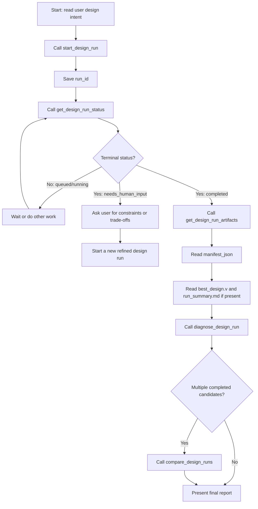

# MCP Agent Integration & Installation Guide

> [!NOTE]
> **Target Audience:** This document is written for AI agents and coding assistants that need to install, configure, test, and register this repository as a Model Context Protocol (MCP) server.

This project currently exposes a **local stdio MCP server** through `python -m mcp_server.server`. Local clients such as Claude Desktop, Cursor, Windsurf, VS Code-style agents, and custom stdio MCP clients can use it directly. Remote or hosted MCP clients require an additional HTTP/remote MCP wrapper that this repository does not yet provide.

---

## 1. System Requirements & Pre-Flight Checklist

Before executing installation commands, verify:

1. **Repository root**
   - Current working directory must contain `app.py`, `requirements.txt`, and the `mcp_server` folder.
   - If a client supports `cwd`, set it to the absolute repository root.

2. **Python**
   - Recommended: Python 3.11.
   - Supported target range: Python 3.11 to 3.14.
   - Verify:
     ```powershell
     python --version
     ```
   - If `python` is not on PATH, try `py -3.11 --version` on Windows or use the absolute Python executable path in MCP client configuration.

3. **Java / Cello**
   - Java is needed for Java-based Cello constraint evaluation subprocesses.
   - Verify:
     ```powershell
     java -version
     ```
   - Read-only MCP tools such as `list_design_runs`, `compare_design_runs`, and `diagnose_design_run` do not need Java.
   - Full design and Verilog evaluation workflows may need Java, `cello_command`, and `ucf_path` depending on local Cello setup.

4. **Secrets**
   - Prefer environment variables over tool arguments for API keys.
   - Do not place real API keys in reusable documentation, shared MCP config, or source-controlled files.

---

## 2. Installation & Verification

### Step 2.1: Install Dependencies

Install runtime and development dependencies:

```powershell
pip install -r requirements.txt
pip install -r requirements-dev.txt
```

Install the MCP server package. It is optional for local unit tests but required to run this repository as an MCP endpoint:

```powershell
pip install mcp
```

### Step 2.2: Smoke Test the Service Layer

Run a lightweight import check from the repository root:

```powershell
python -c "from mcp_server.service import list_design_runs; print(list_design_runs())"
```

Expected behavior: a JSON-like dictionary with `status: completed`.

### Step 2.3: Run MCP-Focused Tests

Preferred project helper:

```powershell
.\scripts\test-mcp.ps1
```

If Python is not available as `python`, pass the executable path:

```powershell
.\scripts\test-mcp.ps1 -Python "C:\path\to\python.exe"
```

Raw pytest equivalent:

```powershell
python -m pytest tests/test_mcp_server.py --basetemp=pytest_temp -o cache_dir=pytest_temp/.pytest_cache
```

Expected behavior: all tests in `tests/test_mcp_server.py` pass.

---

## 3. Model Selection Policy

The server reads the model name from `LITELLM_MODEL`, `OPENAI_MODEL`, or tool arguments. Keep model names current with the provider you use through LiteLLM or direct OpenAI-compatible endpoints.

Recommended defaults:

| Use Case | Suggested Model | Notes |
| :--- | :--- | :--- |
| Default design workflow | `gpt-5.4-mini` | Good balance for coding, tool use, and multi-step agent workflows. |
| Hard biological design / critique | `gpt-5.5` | Prefer for difficult reasoning, final critique, or high-value runs. |
| Cheap smoke tests | `gpt-5.4-nano` | Use only when quality is less important than cost/latency. |
| Legacy fallback | `gpt-4o` or `gpt-4o-mini` | Use only if GPT-5.x models are unavailable in the target environment. |
| Non-OpenAI providers | LiteLLM provider string | Example: `gemini/...` or `anthropic/...`, if configured and tested locally. |

Agent guidance:

- Use lower-cost models for `list_design_runs`, `compare_design_runs`, and `diagnose_design_run` because these tools do not call an LLM internally.
- Use stronger reasoning models for `design_genetic_circuit_quick` and `start_design_run` when the design intent is ambiguous, safety-critical, or biologically constrained.
- If the agent runtime supports reasoning effort or verbosity controls, use low/medium effort for quick runs and high effort for final critique or design repair planning.

---

## 4. MCP Server Configuration

### 4.1 Environment Variables

The server reads:

- `LITELLM_MODEL`: Builder/Translator/Critic model. Default fallback in code is `gpt-5.4-mini`.
- `OPENAI_MODEL`: Secondary model fallback.
- `OPENAI_API_KEY` or `LITELLM_API_KEY`: API authentication key.
- `LITELLM_API_BASE`: Optional custom OpenAI-compatible endpoint.

Example:

```powershell
$env:OPENAI_API_KEY="YOUR_API_KEY_HERE"
$env:LITELLM_MODEL="gpt-5.4-mini"
python -m mcp_server.server
```

### 4.2 Claude Desktop Local Stdio Configuration

Edit:

- Windows: `%APPDATA%\Claude\claude_desktop_config.json`
- macOS: `~/Library/Application Support/Claude/claude_desktop_config.json`

Use an absolute `cwd` so Python can import `mcp_server` reliably:

```json
{
  "mcpServers": {
    "genetic-circuit-workflow": {
      "command": "python",
      "args": ["-m", "mcp_server.server"],
      "cwd": "C:\\path\\to\\A-Multi-Agent-Framework-for-Translating-Natural-Language-to-Genetic-Circuits",
      "env": {
        "OPENAI_API_KEY": "YOUR_API_KEY_HERE",
        "LITELLM_MODEL": "gpt-5.4-mini",
        "PAGER": "cat"
      }
    }
  }
}
```

If `python` is not on PATH, set `command` to the absolute Python executable.

### 4.3 Cursor, Windsurf, or Similar Local MCP Clients

Add a command-line MCP server:

- Name: `genetic-circuit-workflow`
- Type: `command`
- Command: `python`
- Args: `-m mcp_server.server`
- Working directory / cwd: absolute repository root
- Environment: set `OPENAI_API_KEY` or `LITELLM_API_KEY`, plus `LITELLM_MODEL`

### 4.4 Remote / Hosted MCP Clients

This repository does not currently expose a remote Streamable HTTP MCP endpoint. For OpenAI hosted MCP, Claude Managed Agents, or other remote agent platforms, add a remote MCP wrapper first.

Remote deployment requirements:

- Use HTTPS.
- Require authentication.
- Do not pass API keys in query strings.
- Use OAuth/resource-server metadata or the auth mechanism required by the hosting platform.
- Keep long-running design output under a controlled artifact directory.

---

## 5. Tool Reference & Agent Tool Policy

The MCP server exposes 11 tools.

| Tool Name | Key Inputs | Output Shape | Best Use Case |
| :--- | :--- | :--- | :--- |
| `design_genetic_circuit_quick` | `user_intent`, `host_organism`, `compute_budget` | `{status, run_dir, summary, artifacts, error, error_type}` | Short synchronous design attempt. |
| `start_design_run` | `user_intent`, `host_organism`, `compute_budget` | `{run_id, status, ...}` | Longer background design workflow. |
| `get_design_run_status` | `run_id` | `{run_id, status, error, error_type}` | Poll queued/running/completed/needs_human_input runs. |
| `get_design_run_result` | `run_id` | Full persisted result payload | Fetch terminal run details. |
| `list_design_runs` | `limit` | `{status, runs, count, total}` | Find previous run IDs. |
| `cancel_design_run` | `run_id` | `{run_id, status, message}` | Best-effort cancellation. |
| `get_design_run_artifacts` | `run_id` | `{artifacts, manifest}` | Locate generated files. |
| `compare_design_runs` | `run_ids` | `{summary, best_run, ranked_runs, unavailable_runs}` | Compare 2-10 completed candidates. |
| `diagnose_design_run` | `run_id` | `{diagnosis_status, findings, likely_causes, recommended_next_actions}` | Diagnose one run deterministically. |
| `evaluate_cello_verilog` | `verilog`, `host_organism`, `enable_ode` | `{status, summary, best_topology, artifacts}` | Evaluate existing Verilog without LLM generation. |
| `summarize_mcp_design_state` | `state_json` | `{status, summary}` | Compress raw `state.json`. |

Agent selection policy:

- If the user provides Verilog, call `evaluate_cello_verilog`.
- If the user asks for a new design and `compute_budget > 3`, call `start_design_run` and poll status.
- Do not call `get_design_run_result` until status is terminal.
- Always call `diagnose_design_run` before presenting a completed design as final.
- Use `compare_design_runs` when two or more completed candidates exist.
- Use `get_design_run_artifacts` before reading files; do not guess artifact paths.
- If status is `needs_human_input`, ask the user for additional constraints, then start a new refined run. This repository does not yet provide `continue_design_run`.

---

## 6. Agent Design Loop



### Manifest Parsing Pattern

Always load the `manifest_json` path returned from `get_design_run_artifacts(run_id)`.

```json
{
  "run_id": "run_xxx",
  "created_at": "ISO-TIMESTAMP",
  "user_intent": "user description",
  "host_organism": "organism name",
  "artifacts": [
    {
      "key": "best_verilog",
      "path": "C:\\path\\to\\best_design.v",
      "type": "verilog",
      "description": "Best available Cello-compatible Verilog design."
    }
  ]
}
```

Use the manifest list to locate assets programmatically without regex-matching directories.

---

## 7. Troubleshooting

| Symptom | Likely Cause | Fix |
| :--- | :--- | :--- |
| `python` not found | Python is not on PATH | Use `py -3.11` or an absolute Python executable path. |
| `No module named mcp` | MCP package missing | Run `pip install mcp`. |
| `No module named pytest` | Dev dependencies missing | Run `pip install -r requirements-dev.txt`. |
| `No module named mcp_server` | Wrong working directory | Set `cwd` to repository root or run from repo root. |
| MCP client starts but tools are missing | Server failed before registration | Run `python -m mcp_server.server` manually from repo root and inspect stderr. |
| Cello / Java errors | Java, Cello command, or UCF path missing | Verify `java -version`, `cello_command`, and `ucf_path`. |
| Run stays `running` | Background task is still executing | Poll `get_design_run_status`; use `cancel_design_run` for best-effort cancellation. |
| `needs_human_input` | Workflow needs constraints or fallback choice | Ask the user for guidance and launch a refined new run. |

---

## 8. Security Notes

- Local stdio development may use environment variables for secrets.
- Shared or remote MCP deployments should use managed credentials, scoped tokens, and authenticated transport.
- Never place real API keys in committed MCP configs.
- Never pass API keys in URL query strings.
- Background metadata redacts `api_key`, but agents should still avoid sending secrets as tool arguments when environment variables are available.
