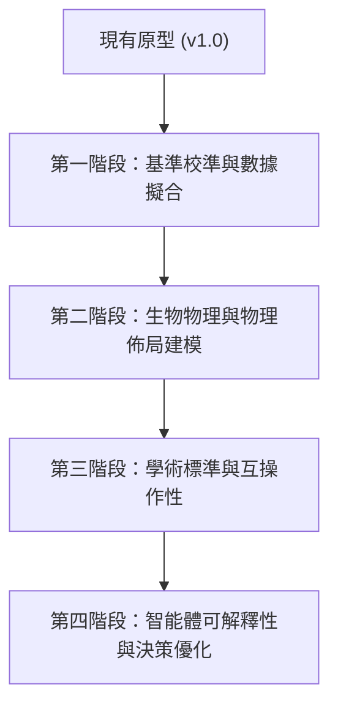

# Future Research Directions for Evidence-Aware Genetic Circuit Design
# 證據感知基因電路設計的未來研究方向

This document records open research and engineering directions for testing the
evidence-aware design hypothesis more rigorously. It is not a claim that every
listed integration is necessary, feasible, or sufficient to create an academic
or biologically predictive tool.

本文件記錄如何更嚴謹地檢驗「證據感知設計」假設的開放研究與工程方向；並不宣稱
所有列出的整合都必須、可行，或足以讓原型成為學術級或具生物預測能力的工具。

---

## 1. Executive Summary / 執行摘要

The current prototype connects LLM-dependent and deterministic computational
modules to produce reviewable candidate representations. Existing evidence
primarily supports software-contract and computational-screening claims.

The most important research gaps concern **experimental calibration**,
**biophysical context modeling**, **robustness characterization**,
**interoperability**, and whether the workflow communicates uncertainty in a
way that matches expert reasoning.

### Current implementation boundary (2026-06-27)

Several roadmap themes now have conservative preview implementations, but the academic-grade versions remain future work:

- Parameter-fit snapshots, comparisons, and provenance are implemented; general CSV/Excel plate-reader ingestion and automatic dynamic part-library recalibration are not.
- Default host profiles, simplified layout checks, temporal inputs, parameter sweeps, and bifurcation-style reports are implemented; calibrated multi-chassis physiology, Sobol/Morris global sensitivity, and numerical continuation are not.
- GenBank import/export and SBOL3 Turtle export/optional semantic validation are implemented; universal bidirectional SBOL/GenBank/SBML conversion is not.
- Local heuristic RNA-folding/RBS-accessibility warnings are implemented; ViennaRNA/NUPACK-equivalent thermodynamic validation and codon-pair/tRNA-aware expression prediction are not.
- Stochastic SSA, retroactivity, operon coupling/polarity, versioned biophysical scoring, and validated best-candidate self-healing are implemented as computational screening paths; none are wet-lab calibrated predictors.
- Regression and release evidence must be interpreted from the current commit
  and evidence package; historical test counts are not a standing scientific
  validation claim.

This boundary takes precedence over older checklist labels such as `[Implemented]` when those labels appear to imply a broader capability.

本專案目前成功利用多智能體（Reflexion 迴圈）與確定性計算工具，將自然語言轉化為基因電路候選方案。為了達到學術發表與濕實驗室應用的高標準，未來的升級應著重於**實驗校準**、**生物物理環境建模**、**魯棒性表徵**以及**標準生物學格式的互操作性**。

---

## 2. Roadmap Phases & Key Upgrades / 路線圖階段與關鍵升級

---

### Phase 1: Benchmark Calibration & Wet-Lab Data Fitting / 第一階段：基準校準與實驗數據擬合

To ensure that the scoring metric is biologically meaningful, we must benchmark the tool against established genetic circuits and allow parameter customization.

為確保評分指標符合真實生物學現狀，系統必須與已發表的電路進行對照，並提供參數擬合功能。

*   **Literature Design Reproduction (文獻設計重現)**
    *   Compile a standard benchmark dataset featuring 20+ experimentally validated synthetic circuits (e.g., Cello 1.0 paper designs, Repressilator, genetic toggles).
    *   Evaluate these designs using the framework's scoring suite. Identify and resolve "false negatives" where viable biological designs receive low scores due to overly conservative heuristic penalties.
    *   建立包含 20 個以上經實驗驗證之經典電路的基準資料集，藉此評估與微調評分系統，減少因過於保守的懲罰項導致「真實可行電路被打低分」的情況。
*   **Experimental Data Importing & Curve Fitting (實驗數據匯入與曲線擬合)**
    *   Develop an API and UI module for importing fluorescent/luminescent plate reader data (CSV/Excel formats).
    *   Implement automatic Hill equation fitting to extract $y_{\text{min}}$, $y_{\text{max}}$, $K_d$, and $n$ directly from user wet-lab measurements, updating the parts library dynamically.
    *   開發 API 與 UI 介面以匯入微孔板讀數儀（Plate Reader）數據，自動擬合 Hill 方程式，並動態更新元件庫中的表徵參數（$y_{\text{min}}, y_{\text{max}}, K_d, n$）。

---

### Phase 2: Biophysical Modeling & Spatial Layout Analysis / 第二階段：生物物理建模與物理佈局分析

A genetic circuit's performance is heavily influenced by the spatial layout of transcription units on the plasmid and global resource constraints.

基因電路在質體上的物理排列順序以及宿主細胞內的資源爭奪，是決定其實驗成敗的關鍵因素。

*   **DNA Physical Layout & Context Effect Evaluation (質體物理佈局與上下文效應評估)**
    *   Implement a **Layout Critic** to check the ordering, orientation, and spacing of promoters, RBSs, coding sequences, and terminators on the plasmid.
    *   Check for potential **transcript_read-through** (due to leaky terminators) and **promoter interference** (due to supercoiling or overlapping regulatory regions).
    *   實作「佈局評論者（Layout Critic）」，分析基因在 DNA 鏈上的排列順序與方向，防止因轉錄讀穿（Read-through）或啟動子干擾（Promoter Interference）導致設計失效。
*   **Multi-Chassis Default Profiles (多宿主細胞生理參數 Profiles)**
    *   Allow users to swap chassis targets (e.g., E. coli, Yeast, HEK293) and automatically load host-specific physiological baselines (baseline transcription speed, growth rates, degradation rates).
    *   允許使用者一鍵切換宿主目標，自動載入不同宿主特異性的生理參數基準值（如轉錄速率、生長稀釋常數、基礎降解速率等）。
*   **Host-Circuit Metabolic Burden & Growth Coupling (代謝負荷與宿主生長耦合模擬)**
    *   Model the competition for free ribosomes and RNAP between the synthetic circuit and the host genome. Update the ODE model to dynamically scale the dilution rate based on metabolic burden.
    *   模擬外源電路與宿主基因組對游離核糖體與 RNAP 的爭奪，動態更新 ODE 模型以呈現由於代謝負荷（Burden）導致的生長減緩與蛋白質稀釋率反饋。
*   **Multi-Layer Central-Dogma Resource Accounting (中心法則多層資源核算模型)**
    *   Connect DNA copy-number and promoter context, transcriptional demand and RNAP allocation, RNA production/accessibility/degradation, translational demand and ribosome allocation, protein maturation/degradation, and growth-dilution feedback in a layered mathematical representation.
    *   Report which layer, assumption, or missing parameter dominates a candidate's result, and distinguish observed inputs from defaults and inferred quantities.
    *   Treat the model as a diagnostic and comparative lens. It is not intended to reproduce a real cell, construct a whole-cell model, or create a biological digital twin.
    *   將 DNA copy number 與 promoter context、轉錄需求與 RNAP 分配、RNA 生成／可及性／降解、轉譯需求與 ribosome 分配、蛋白質成熟／降解，以及生長稀釋回饋連接成分層數學表示。
    *   報告哪一層、哪項假設或哪個缺失參數主導候選結果，並區分實際輸入、預設值與推導量。
    *   此模型定位為診斷與比較視角，不以重現真實細胞、建立 whole-cell model 或生物數位分身為目標。
*   **Dynamic Temporal Input Profiles (多狀態與時序輸入模擬)**
    *   Enable users to define multi-stage, dynamic input profiles over time (e.g., pulsatile or step inputs of inducers).
    *   Evaluate system kinetics under transitions, identifying delay times, overshoot, and bi-stable latching behavior.
    *   支援隨時間變化的多階段誘導劑輸入模擬，精確評估電路在狀態切換時的響應時間、過沖（Overshoot）與多穩態行為。
*   **Global Parameter Sensitivity & Bifurcation Analysis (全域敏感度與分歧分析)**
    *   Integrate Sobol or Morris global sensitivity analysis to evaluate which parameters (e.g., repressor degradation rate, plasmid copy number) have the highest impact on circuit stability.
    *   Generate 1D/2D bifurcation diagrams (分歧圖) to visualize the operational window of the circuit under varying host environments.
    *   引入 Sobol 全域敏感度分析，並自動繪製一維/二維分歧圖，將電路在不同宿主環境下的「安全運作窗口（Operating Window）」大小作為核心評分指標。

---

### Phase 3: Academic Standards & Interoperability / 第三階段：學術標準與互操作性 (Partially Implemented Preview / 部分完成預覽)

Academic tools must integrate seamlessly into the broader bioinformatics software ecosystem.

學術工具必須能與現有的生物資訊學生態系統無縫對接，支持國際標準格式。

*   **Standard Formats Export: SBOL 3.0 & GenBank (標準格式導出：SBOL 3.0 與 GenBank)** [Preview Implemented]
    *   The current preview exports SBOL3 Turtle with optional `sbol3` semantic validation and produces richly annotated GenBank records with round-trip regression coverage.
    *   Universal bidirectional SBOL XML/JSON-LD import/export, broader external-tool compatibility testing, and SBML conversion remain future work.
    *   目前預覽版支援 SBOL3 Turtle 匯出與可選的 `sbol3` 語意驗證，並可產生具有豐富註記及 round-trip 回歸測試的 GenBank 記錄；全面雙向 SBOL XML/JSON-LD、更多外部工具相容性驗證與 SBML 轉換仍屬未來工作。
*   **Advanced Codon Optimization & RNA Folding Validation (進階密碼子優化與 RNA 折疊驗證)** [Partially Implemented Preview]
    *   The current preview reports host-specific CAI and rare-codon metrics and provides heuristic RNA/RBS accessibility checks with optional ViennaRNA execution when available.
    *   NUPACK integration, codon-pair bias, calibrated tRNA-aware expression prediction, and thermodynamic equivalence claims are not implemented.
    *   目前預覽版提供宿主特異性 CAI、稀有密碼子指標，以及啟發式 RNA/RBS 可及性檢查；環境允許時可選用 ViennaRNA。NUPACK、密碼子對偏好、經校準的 tRNA 表現量預測及熱力學等效性主張尚未完成。

---

### Phase 4: Agent Reasoning & Explainable Critic / 第四階段：智能體推理與可解釋性優化 (Partially Completed: Self-Healing & Biophysical Scoring / 部分已完成：自我修復與生化評分)

Improve the transparency of agent decisions to build trust with wet-lab biologists.

提升 AI 智能體決策的透明度，建立濕實驗室科學家對系統設計決策的信任。

*   **Explainable Diagnostics Panel (可解釋性診斷面板)**
    *   Create an interactive audit log in the Streamlit UI showing exactly why a candidate design was penalized (e.g., highlighting specific kinetic curves or sequence motifs).
    *   Provide actionable recommendations from the Critic agent for adjusting model assumptions or experimental designs when a discrepancy occurs.
    *   在 UI 中提供可解釋的診斷日誌，清晰指出評分偏低的物理或生物化學原因，並提供可調整設計參數的引導建議。
*   **Crosstalk & Orthogonality Heatmap Visualization (正交性與交叉干擾矩陣可視化)**
    *   Generate an interactive heatmap matrix in the UI displaying predicted crosstalk probabilities between repressors and promoters used in the circuit, helping researchers audit parts compatibility.
    *   在 UI 中生成可互動的熱圖矩陣，展示電路中各元件之間的預測交叉反應機率，幫助研究者直觀審查元件正交性。
*   **Biophysical Constraint-Guided Self-Healing (基於生物物理約束的智能體自我修復)**
    *   Enhance the Critic-Builder Reflexion loop to suggest logical, sequence, or tag adjustments (e.g., appending degradation tags or switching to cooperativity-driven transcription factors) based on specific biophysical failure modes.
    *   優化 Critic-Builder 的反射修復機制，當模擬結果不符預期時，引導智能體根據物理約束提出具體的「自癒」修改建議（如加上活性降解標籤或更換高合作性的轉錄因子）。
*   **Knowledge-Graph Augmented RAG (知識圖譜增強檢索)**
    *   Expand the retrieval-augmented generation (RAG) system with a structured biology knowledge graph to prevent agents from using incompatible parts (e.g., parts requiring different growth media or expressing toxic intermediates).
    *   利用結構化生物知識圖譜（Knowledge Graph）增強 RAG，防止智能體在生成邏輯時推薦具有配伍衝突或毒性累積的生物元件。

---

## 3. Recommended Open-Source Libraries & Integration Map / 推薦開源程式庫與整合地圖

To prevent rewriting complex biophysical and mathematical algorithms from scratch, future implementation should directly integrate the following peer-reviewed, open-source Python libraries into the multi-agent workflow:

為了避免從零開始編寫複雜的生物物理與數學演算法，未來實作應直接將下列經過同儕審查、成熟開源的 Python 程式庫整合至多智能體工作流中：

### 1. Data Fitting & Parametrization / 數據擬合與參數化
*   **`lmfit`**
    *   **Mapped Feature / 對接功能**: Hill equation curve fitting for wet-lab data (Phase 1).
    *   **Advantage / 優勢**: Provides robust parameter constraints (e.g., forcing Hill coefficient $n > 0$, bounding expression levels) and outputs comprehensive fit confidence intervals, superior to standard SciPy optimization.
    *   **對接功能**：對濕實驗室數據進行 Hill 方程式曲線擬合。能設定嚴格的參數範圍约束，並自動輸出信賴區間。

### 2. Biophysical Modeling & Simulation / 生物物理建模與模擬
*   **`Tellurium` & `roadrunner`**
    *   **Mapped Feature / 對接功能**: High-performance ODE/stochastic simulation and SBML integration (Phase 2).
    *   **Advantage / 優勢**: Extremely fast C++ backend solver wrapped in Python. Native support for events (temporal inputs) and simulation of chemical kinetics models.
    *   **對接功能**：高效能 ODE 模擬與 SBML 模型對接。支援時間事件（誘導劑時序切換），解算速度極快。
*   **`BioCRNpyler` (Caltech)**
    *   **Mapped Feature / 對接功能**: Translation of high-level genetic parts into detailed Chemical Reaction Networks (CRNs) (Phase 2).
    *   **Advantage / 優勢**: Automatically generates biochemical networks including transcription, translation, and resource competition (ribosome and RNAP limits).
    *   **對接功能**：自動將基因設計轉譯為底層生化反應網絡，並對核糖體與 RNAP 的資源爭奪進行建模。

### 3. Bifurcation & Sensitivity Analysis / 分歧與敏感度分析
*   **`PyDSTool`**
    *   **Mapped Feature / 對接功能**: Bifurcation analysis and parameter sweep (Phase 2).
    *   **Advantage / 優勢**: Pure-python environment for dynamical systems that supports automated continuation (AUTO-07p wrapper) to find operational boundaries of multistable switches and oscillators.
    *   **對接功能**：多穩態開關或振盪器的參數臨界點（分歧點）分析與參數掃描。

### 4. Standard Formats & Interoperability / 學術標準格式與互操作
*   **`pySBOL3`**
    *   **Mapped Feature / 對接功能**: SBOL 3.0 document generation and verification (Phase 3).
    *   **Advantage / 優勢**: Official Python bindings for the Synthetic Biology Open Language, ensuring compliant graph metadata structures.
    *   **對接功能**：導出符合國際標準的 SBOL 3.0 電路圖與 XML/JSON 資料。
*   **`SynBiopython`**
    *   **Mapped Feature / 對接功能**: Formats conversion (SBOL <-> GenBank <-> SBML) (Phase 3).
    *   **Advantage / 優勢**: Acts as a universal parser wrapper, reducing format transformation coding overhead.
    *   **對接功能**：在 SBOL、GenBank、GFF3 和 SBML 等各種生物資訊格式之間進行萬用轉換。

### 5. RNA Secondary Structure / RNA 二級結構預測
*   **`ViennaRNA` (SWIG Python bindings) or `NUPACK` (Python wrapper)**
    *   **Mapped Feature / 對接功能**: mRNA folding and RBS availability validation (Phase 3).
    *   **Advantage / 優勢**: Industry-standard thermodynamics computation to check minimum free energy (MFE) and prevent ribosome blocking.
    *   **對接功能**：評估 mRNA 折疊與 RBS 暴露程度，避免轉譯起始區因二級結構鎖定而失效。

---

## 4. Prioritized Implementation Checklist / 優先開發清單

To guide the next steps of implementation, we suggest prioritizing tasks by balancing academic impact and development complexity:

| 升級項目 (Feature) | 實作方式 (Implementation) | 推薦整合庫 (Recommended Library) | 學術影響度 (Academic Impact) | 開發難易度 (Complexity) | 推薦優先級 (Priority) |
| :--- | :--- | :--- | :---: | :---: | :---: |
| **1. 經典文獻設計重現與評分校準** | 自定義評估 (Custom Eval) | N/A (Manual Benchmarking) | High | Medium | **P0 (Immediate)** |
| **2. 實驗數據匯入與 Hill 參數擬合** | **開源庫調用 (Library Call)** | `lmfit` | High | Medium | **P0 (Immediate)** |
| **3. 多宿主細胞生理參數 Profile 切換** | 配置檔加載 (Config Loader) | N/A (Config Profiles) | High | Low | **P1 (High)** |
| **4. GenBank / SBOL 檔案格式匯出** | **開源庫調用 (Library Call)** | `pySBOL3`, `SynBiopython` | Medium | Low | **P1 (High)** |
| **5. DNA 佈局與上下文干擾評估 (Layout Critic)**| **開源庫調用 (Library Call)** | `Biopython` | High | High | **P1 (High)** |
| **6. 代謝負荷與宿主生長耦合動態模擬** | **開源庫調用 (Library Call)** | `BioCRNpyler` | High | High | **P1 (High)** |
| **7. 時序輸入動態模擬與分歧分析** | **開源庫調用 (Library Call)** | `Tellurium`, `PyDSTool` | High | High | **P2 (Medium)** |
| **8. 交叉反應與正交性矩陣熱圖可視化** | UI與圖表繪製 (UI/Plotting) | N/A (Plotly / Seaborn) | Medium | Low | **P2 (Medium)** |
| **9. 基於生物物理約束的智能體自我修復** | 智能體 Prompt 調整 (Agent Prompts) | N/A (Agent Prompt) | High | Medium | **P2 (Medium)** |
| **10. 可解釋性診斷面板與防呆機制** | UI與智能體整合 (UI/Agent) | N/A (UI / Agent Prompt) | Medium | Low | **P2 (Medium)** |
| **11. CRISPRi/CRISPRa 基因電路設計支援** | **開源庫調用 (Library Call)** | `BioCRNpyler`, `NUPACK`, `Cas-OffFinder` | High | High | **P3 (Long-Term)** |

---

## 5. Long-Term Vision: CRISPR-Based Genetic Circuits (CRISPRi/CRISPRa) / 長期願景：基於 CRISPR 的基因電路設計

### Bypassing Cello's Host & Gate Library Limitations / 突破 Cello 的宿主與元件庫限制
Traditional logic synthesis tools like Cello are tightly constrained by protein-based gate libraries (User Constraint Files - UCFs), which require tedious strain-specific characterization and suffer from low scalability (due to protein crosstalk). 

By pivoting towards **CRISPR Interference (CRISPRi)** and **CRISPR Activation (CRISPRa)**, the system can design sequence-programmable circuits that are highly scalable and portable across bacteria, yeast, and mammalian cells without relying on fixed UCF files.

傳統邏輯合成工具（如 Cello）受限於蛋白質轉錄因子的元件庫（UCF），需要耗時的特定宿主表徵且擴展性低。轉向 **CRISPRi（轉錄干擾）** 與 **CRISPRa（轉錄激活）** 可以實現由序列編程的基因電路，突破元件數量限制，且無需依賴特定 UCF 即可輕鬆移植於細菌、酵母菌與哺乳動物細胞。

### Proposed Open-Source CRISPR Integration Workflow / 開源 CRISPR 整合工作流
Instead of custom-implementing CRISPR biophysical dynamics, we propose combining existing specialized tools:

無需從零開發 CRISPR 生物物理機制，未來可藉由組合以下開源工具鏈來實現設計：

1.  **gRNA Target & Off-Target Screening / 序列生成與脫靶篩選**
    *   **Tool**: `Cas-OffFinder` (or Biopython-based local alignment).
    *   **Role**: Check candidate gRNA spacer sequences against the host genome (e.g., human, yeast, E. coli) to filter out potential off-target binding sites.
    *   **對接功能**：對候選 gRNA 進行宿主全基因組比對，篩除具有脫靶風險的序列。
2.  **Thermodynamic Binding Prediction / 結合熱力學預測**
    *   **Tool**: `NUPACK`.
    *   **Role**: Predict the hybridization free energy ($\Delta G$) of the gRNA spacer with the target promoter DNA. Thermodynamic binding energy correlates strongly with in vivo repression/activation efficiency, allowing the agent to predict the Hill parameters ($K_d$ and $n$) computationally.
    *   **對接功能**：預測 gRNA 與標靶 DNA 的雜交自由能，藉此在計算層面預估其轉錄抑制/激活效率（對應 Hill 方程式中的 $K_d$ 值）。
3.  **CRISPR Kinetics Compiled to ODEs / CRISPR 動力學編譯與模擬**
    *   **Tool**: `BioCRNpyler`.
    *   **Role**: BioCRNpyler has built-in mechanisms for CRISPR systems. It automatically compiles high-level CRISPR logic (e.g., `dCas9 + gRNA <-> Complex`, `Complex + Promoter <-> Bound_Promoter`) into exact chemical reaction networks and ODE systems for Tellurium simulation.
    *   **對接功能**：自動將高階 CRISPR 邏輯（dCas9/gRNA 複合物形成、標靶啟動子結合）編譯為精確的 ODE 動力學模型進行模擬。

